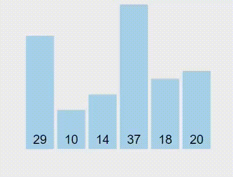
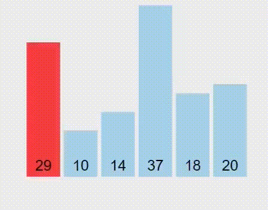
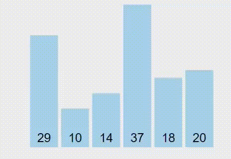
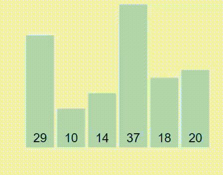
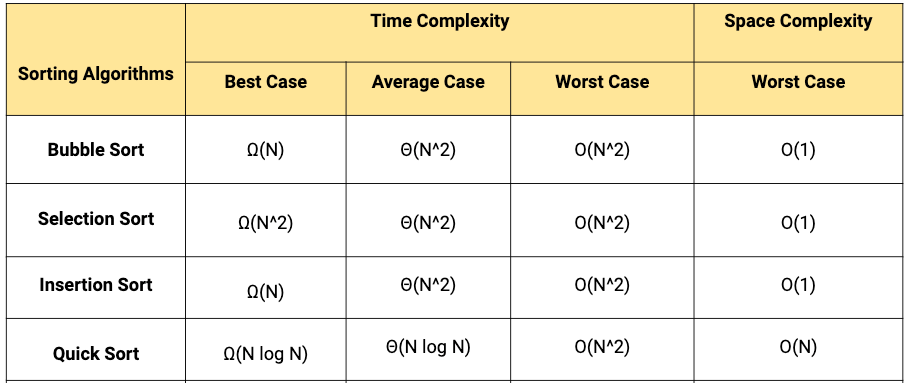
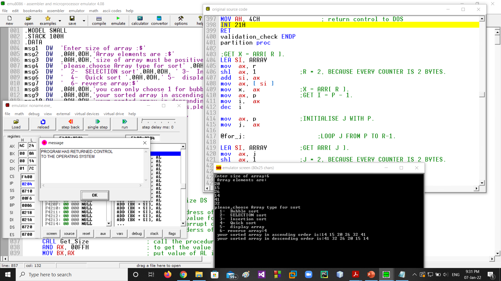

# Array-Sorting Algorithms

## Project Contributers:
| # | Name | Github link |Role
| ------ | ------ |--------|----------|
| 1 | Karim Moftah | [karim-moftah]|Get_Size + Reverse Array+ README
| 2| Abdelrahman Sayed | [abdelrahman-Sayed-abdelhamid]|Print Array + decimal_2_ascii
| 3 | Mohammed Salah |[mohamedsalah674]|Get_Array + Ascii_2_decimal
| 4| Mohammed Ahmed Ibrahim |[mohamedmahfouz3]|Bubble sort + Selection sort
| 5 |Ammar Adel |[ammaradel17]|Insertion sort + Quick sort


## Project Functions:
| # | Function | 
| ------ | ------ |
| 1 | `Bubble Sort`
| 2| `Selection Sort`
| 3 | `Insertion Sort`
| 4| `Quick Sort`
| 5| `Print Array`
|6| `Reverse Array`


## Project Tool
 EMU8086
 
## Project Language
assembly x86
## Summury

this is an array sorting project written in assembly x86 sorts an array of elements using Bubble sort, Selection sort, Insertion sort or Quick sort and prints the sorted array in ascending and descending order

````
1- Enter array size 
2- Enter array elements 
3- choose one of the sorting algorithms
````

## Introduction 

A Sorting Algorithm is used to rearrange a given array or list elements according to a comparison operator on the elements. The comparison operator is used to decide the new order of element in the respective data structure.

The efficiency of any sorting algorithm is determined by the time complexity and space complexity of the algorithm.

1. Time Complexity: Time complexity refers to the time taken by an algorithm to complete its execution with respect to the size of the input. 
 2. Space Complexity: Space complexity refers to the total amount of memory used by the algorithm for a complete execution. It includes both the auxiliary memory and the input.


---

###  Bubble Sort Algorithm
> **Description**

Bubble Sort compares neighboring elements and forces larger elements to 'bubble' to the end of an array while simultaneously 'floating' smaller elements to the top/front of a list.

> **Details**

-It is a simple algorithm which is used to sort a given set of n elements provided in form of an array with n number of elements. Bubble Sort compares all the element one by one and sort them based on their values.

-If the given array has to be sorted in ascending order, then bubble sort will start by comparing the first element of the array with the second element, if the first element is greater than the second element, it will swap both the elements, and then move on to compare the second and the third element, and so on.

-If we have total n elements, then we need to repeat this process for n-1 times.

-It is known as bubble sort, because with every complete iteration the largest element in the given array, bubbles up towards the last place or the highest index, just like a water bubble rises up to the water surface.

-Sorting takes place by stepping through all the elements one-by-one and comparing it with the adjacent element and swapping them if required.


> **Bubble Sort Animation**



> **Bubble Sort in java**

````java
void bubbleSort()
{
int out, in;
for(out=nElems-1; out>1; out--) // outer loop (backward)
    for(in=0; in<out; in++) // inner loop (forward)
        if( a[in] > a[in+1] ) // out of order?
            swap(in, in+1); // swap them
} // end bubbleSort()
//--------------------------------------------------------------
void swap(int one, int two)
{
long temp = a[one];
a[one] = a[two];
a[two] = temp;
}
````


###  Selection Sort Algorithm
> **Description**

selection sort works by selecting an item in the list and comparing it to another item and making a swap if the items are ordered incorrectly. Unlike bubble sort, selection sort works by sorting the smallest items into position first.

> **Details**

If the given array has to be sorted in ascending order, then selection sort will start by comparing the first element of the array with the second element, if the first element is greater than the second element, it will swap both the elements, and then move on to compare the second and the third element, and so on.

In selection sort, the smallest value among the unsorted elements of the array is selected in every pass and inserted to its appropriate position into the array. It is also the simplest algorithm. It is an in-place comparison sorting algorithm. In this algorithm, the array is divided into two parts, first is sorted part, and another one is the unsorted part. Initially, the sorted part of the array is empty, and unsorted part is the given array. Sorted part is placed at the left, while the unsorted part is placed at the right.

In selection sort, the first smallest element is selected from the unsorted array and placed at the first position. After that second smallest element is selected and placed in the second position. The process continues until the array is entirely sorted.


> **Selection Sort Animation**



> **Selection Sort in java**

````java
void selectionSort()
{
int out, in, min;
for(out=0; out<nElems-1; out++) // outer loop
{
min = out; // minimum
for(in=out+1; in<nElems; in++)// inner loop
if(a[in] < a[min] ) // if min greater,
min = in; // we have a new min
swap(out, min); // swap them
} // end for(out)
} // end selectionSort()
//--------------------------------------------------------------
void swap(int one, int two)
{
long temp = a[one];
a[one] = a[two];
a[two] = temp;
}
````
###  Insertion Sort Algorithm
> **Description**

Sorts a list by creating a left sorted segment and inserting items from the right unsorted segment.

> **Details**

Insertion sort works similar to the sorting of playing cards in hands. It is assumed that the first card is already sorted in the card game, and then we select an unsorted card. If the selected unsorted card is greater than the first card, it will be placed at the right side; otherwise, it will be placed at the left side. Similarly, all unsorted cards are taken and put in their exact place.

-If the element is the first element, assume that it is already sorted. Return 1.

-Pick the next element, and store it separately in a key.

-Now, compare the key with all elements in the sorted array.

-If the element in the sorted array is smaller than the current element, then move to the next element. Else, shift greater elements in the array towards the right.

-Insert the value.

-Repeat until the array is sorted.


> **Insertion Sort Animation**



> **Insertion Sort in java**

````java
void insertionSort()
{
int in, out;
for(out=1; out<nElems; out++) // out is dividing line
{
long temp = a[out];// remove marked item
in = out;// start shifts at out
while(in>0 && a[in-1] > temp)// until one is smaller,
{
a[in] = a[in-1]; // shift item right,
--in; // go left one position
}
a[in] = temp; // insert marked item
} // end for
} // end insertionSort()
````

###  Quick Sort Algorithm
> **Description**

quick sort algorithm uses a divide and conquer approach to sort a list (array) by recursively partitioning and sorting it. The array is changed in place

> **Details**

`Divide`: In Divide, first pick a pivot element. After that, partition or rearrange the array into two sub-arrays such that each element in the left sub-array is less than or equal to the pivot element and each element in the right sub-array is larger than the pivot element.

`Conquer`: Recursively, sort two subarrays with Quicksort.

`Combine`: Combine the already sorted array.

Quicksort picks an element as pivot, and then it partitions the given array around the picked pivot element. In quick sort, a large array is divided into two arrays in which one holds values that are smaller than the specified value (Pivot), and another array holds the values that are greater than the pivot.

After that, left and right sub-arrays are also partitioned using the same approach. It will continue until the single element remains in the sub-array.

##### Choosing the pivot
Picking a good pivot is necessary for the fast implementation of quicksort. However, it is typical to determine a good pivot. Some of the ways of choosing a pivot are as follows -

* Pivot can be random, i.e. select the random pivot from the given array.
* Pivot can either be the rightmost element of the leftmost element of the given array.
* Select median as the pivot element.


> **Quick Sort Animation**



> **Quick Sort in java**

````java
Quick_sort(A, start, end)
{
If (start>=end)
Return
Pindex=Partition(A, start, end)
Quick_sort(A,start,Pindex-1)
Quick_sort(A,Pindex+1,end)
}

Partition(A, start, end)
{
Pivot=A[end]
Pindex=start
For (i=start ; end-1; i++)
{
If (A[i]<=pivot)
{
Swap(A[i], A[Pindex])
Pindex=Pindex+1
}
}
Swap(A[Pindex], A[end])
Return (Pindex)
}
````

## sorting algorithms complexity

## Output



## Credit

> **Thanks to**
* `Prof. Abdelhamid Attaby` 
*  `Eng. Ahmed Bakr`

for thier support during the course .
## Refernces
prentice_the_intel_microprocessors_8th_edition_013.

   [karim-moftah]: <https://github.com/karim-moftah>
   [abdelrahman-Sayed-abdelhamid]: <https://github.com/abdelrahman-Sayed-abdelhamid>
   [mohamedsalah674]: <https://github.com/mohamedsalah674>
   [ammaradel17]: <https://github.com/ammaradel17>
   [mohamedmahfouz3]: <https://github.com/mohamedmahfouz3>
"# Assembly_Code_Srray_Sorting" 
